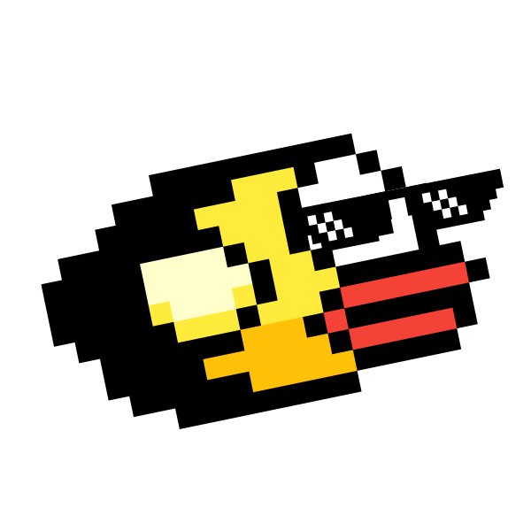

# FlappyBird-OOP-Project
## HCMIU - Semester 2 2021-2022

**Members:**  
**Nguyen Dang Tu Quyen - ITITIU20016 - ndtquyen147@gmail.com**  
**Huynh Thi Tu Chi - ITITIU20175 - huynhthituchi2002@gmail.com**  
**Huynh Ngoc Hoai An - ITITIU20152 - scout112323@gmail.com**  
**Nguyen Dang Bao - ITITIU20164 - brendanbao12@gmail.com**  

**Introduction:**  
* *We love to make a loop game that means we can minimize the number of different levels as the bugs in each level like Boom Game, PacMan.
As we know, Flappy Bird is a popular game title so we can find many references and assets. We want to build the new one that is interesting with the same rules game.*  

**Technologies:**
> Java 17

**Launch:**  
- Game entrance is `FlappyBird-OOP-Project\src\FlappyBird\Main.java` run `main method` directly.
 
**Reference:**
https://github.com/sunzhichao/FlappyBird

https://github.com/granttitus/FlappyBird

https://github.com/ajsaavedra/FlappyBird

**The project "Flappy Bird":**
> 1. The rules:
  - About the rules of the button and the arrow flashes
     > a) The button:
       + buttonOne (the red button): This is the button to select different birds in different levels. When you reach a certain milestone, you will unlock a bird with          a different look. In that time, this button will help you select the favorite bird if you want.
       + buttonTwo (the yellow button): When you press space on this button, you will start the game.
       + buttonThree (the blue button): This is the leaderboard to show the score you have achieved.
      
     > b) The signal to move (the arrow flashes):
       + "^" signal: to move up
       + "v" signal: to move down
       + ">" signal: to go the next button
       + "<" signal: to return the before button
  - About the rules to play the game
      + Using the signals to move the birds by ^ (fly up), v (fly down)
      + During the play, the player must maintain a safe distance between the bird and the pipe. This means that the bird must not fly too high (hit the upper pipe)           nor should the bird fly too low (hit the lower pipe). If the bird follows the safe spots, the game will continue.
      + In the case, if the bird hits the pipe, it will die and the game will be over.
> 2. Design (the effects in welcomeScreen):
  - Backgroud: We changed the background instead of the simple blue background, it's now more attractive because of the beautiful scene (blue sky, mountain, jungle,       ground).
  - Cloud: The clouds are shown throughout the game from start to finish (this is a new point in our game). The clouds will be moved dynamically.
  - Welcome: The game name “Flappy bird” was added at the beginning. Moreover, we made it more colorful and beautiful. And the words "Press space to continue" are         displayed under the game name. We added them to liven up the welcome part.

